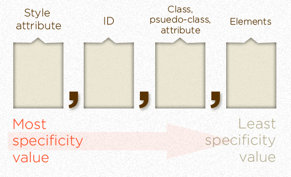
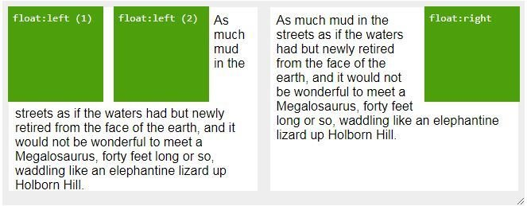
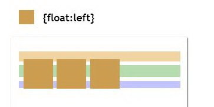
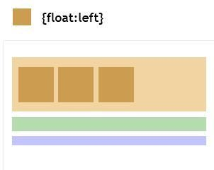

<p align="center">
    
</p>

# Основы CSS. Часть 1

## Каскад

CSS являются **каскадными** таблицами стилей. Это важно, так как показывает, как именно стили применяются к элементам документа.

CSS-каскад называется так, потому что объявления стилей "каскадируются" на элементы из многих источников.

Каскад комбинирует важность, происхождение, специфичность и порядок источников для принимаемых стилей, чтобы точно и безконфликтно определить, какой именно стиль должен быть применен к конкретному элементу.

Также в CSS действует наследование, благодаря которому элемент может получить какие-либо стили от родительского элемента, если они не определены для него. При этом не все свойства могут наследоваться. Например, свойство `text-size` передается потомкам, а `padding` - нет.

## Селекторы

Селектор предназначен для выбора определенной части HTML-документа.

После выбора набора элементов можно задать им определенные свойства. Они определяются после селектора, заключены в фигурные скобки и имеют следующий формат: `property: value;`. Важно не забывать о точке с запятой в конце каждого свойства.

Существует несколько способов выбора элементов.

### Селектор по тегу

Самый простой способ заключается в использовании названия тега. Например, ниже выбираются все заголовки первого уровня:

```css
h1 {
    ...;
}
```

### Селекторы по ID и классам

Другой способ выбора части документа - использовать ID и классы. Этот метод позволяет более гибко выбирать элементы страницы.

Для выбора уникального элемента используются ID. На странице не должно быть более одного элемента с одинаковыми ID.

```html
<div id="myfavdiv">Hiyya!</div>
```

```css
#myfavdiv {
    ...;
}
```

Классы определяют группу тегов.

```html
<div class="smalldivs">itsy-bitsy</div>
<div class="smalldivs">tiny</div>
```

```css
.smalldivs {
    ...;
}
```

### Группировка селекторов

Кроме того, селекторы можно группировать, например, возможно выбрать заголовки первого и второго уровня:

```css
h1,
h2 {
    ...;
}
```

### Универсальный селектор

Также стоит упомянуть об универсальном селекторе `*`. Этот селектор позволяет выбрать абсолютно все элементы страницы.

```css
* {
    color: green;
}
```

### Селектор потомков

Чтобы выбрать какой-либо элемент, вложенные в другой, используют селектор потомков.

Например, конструкция

```css
#one div span {
    color: red;
}
```

задаст красный цвет текста всем `span`, которые находятся внутри всех `div`, которые в свою очередь вложены в элемент с ID `one`.

### Child-селектор

Данный селектор используется, когда надо выбрать только прямых потомков, т.е. вложенных непосредственно в родителя. Например:

```html
<div id="container">
  <div class="box">1</div>
  <div class="box">2</div>
  <div>
    <div>
      <div>
        <div class="box">
          3
        </div>
      </div>
    </div>
  </div>
  <div class="box">4</div>
</div>
<div class="box">5</div>
```

```css
#container > .box {
    color: red;
}
```

В данном случае красным цветом будут отображаться только `1`, `2`, `4`.

### Sibling-комбинатор

General Sibling Combinator позволяет выбрать элементы, расположенные рядом, т.е. те, которые находятся на том же уровне вложенности после нужного элемента.

Например:

```html
 <div class="box">
   <p>0</p>
 </div>

 <h2>Title</h2>
 <p>1</p>
 <p>2</p>

 <div>
   <p>3</p>
   <p>4</p>
 </div>

 <div class="box">
   <span><p>5</p></span>
 </div>
```

```css
h2 ~ div p {
    color: red;
}
```

В данном случае красными будут числа, которые расположены в параграфах внутри дивов, идущих после `h2` на одном уровне с ним, т.е. 3, 4, 5.

Также можно использовать Adjacent Sibling Combinator, который аналогичен General, но позволяет выбрать только смежные элементы.

Например, для примера выше можно применить такое правило:

```css
h2 + p {
    color: red;
}
```

В этом случае красным будет только число 1.

### Селектор по атрибутам

Данный селектор позволяет выбрать элементы с определенными атрибутами.

[example](http://jsbin.com/pocope/edit?html,css,output)

### Псевдо-классы

Псевдо-классы используются для определения псевдо-состояния, в котором может быть элемент. Для использования псевдо-классов использоуется `:`.

[example](http://jsbin.com/qeweri/edit?html,css,output)

[Читать подробнее о псевдо-классах](http://htmlbook.ru/css/cat/pseudoclass).

### Псевдо-элементы

Также в CSS можно определять псевдо-элементы с помощью `::`.

[example](http://jsbin.com/dumayo/edit?html,css,output)

[Читать подробнее о псевдо-элементах](http://htmlbook.ru/css/cat/pseudoelement).

[См. подробнее о селекторах](http://css.yoksel.ru/css-selectors/).

[См. подробнее о селекторах](http://css.yoksel.ru/css-selectors-part2/).

## Специфичность селекторов

Браузер руководствуется специфичностью селекторов при выборе свойств CSS, которые наиболее релевантны для элемента и будут к нему применены.

Наибольший вес имеют инлайн-стили. Далее по значимости идут селекторы по ID, далее по классам, атрибутам и псевдо-классам. Наименьшим весом обладают селекторы тегов и всевдо-элементов.



### !important

При использовании `!important` в объявлении свойства оно перекрывает любое другое объявление.

Использование `!important` считается плохой практикой, его стоит избегать, т.к. оно затрудняет дебаггинг из-за нарушения естественного каскадирования ваших стилей.

### Важные замечания

-   Универсальный селектор `*` обладает нулевым весом

-   Псевдо-элементы имеют вес (0, 0, 0, 1) в отличие от псевдо-классов (0, 0, 1, 0)

-   Псевдо-класс `:not()` не добавляет специфичности селектору

-   Значение `!important` может перекрыться только другим `!important`, определенным в CSS позже. Можно считать, что его вес составляет 1, 0, 0, 0, 0

[Подробнее про вес селекторов](http://css.yoksel.ru/specifity/).

[Подробнее про вес селекторов](https://css-tricks.com/specifics-on-css-specificity/).

[Подробнее про вес селекторов](https://habr.com/post/137588/).

[Подробнее про вес селекторов](http://cssspecificity.com/).

[CSS: Селекторы, псевдоклассы. Специфичность и наследование](https://events.yandex.ru/lib/talks/560/).

[Селекторы и производительность. Часть 1](http://webhitech.ru/articles/selectors-performance-part-1/).

## Content

С помощью CSS можно задать контент элементу.

[example](http://jsbin.com/lokegi/edit?html,css,output)

## Верстка с помощью CSS

### Display

Свойство [`display`](http://htmlbook.ru/css/display) может принимать несколько значений, основные из них:

-   `inline` (по умолчанию свойство применяется к тегам `<span>`, `<a>`, `<input>`)

-   `block` (по умолчанию свойство применяется к тегам `<div>`, `<p>`, `<h1>`)

-   `inline-block` (по умолчанию свойство применяется к тегам `<button>`, `<select>`)

Об этом уже упоминалось в [html-разделе](html-fundamentals#блочные-элементы).

### Float

Свойство определяет, к какой стороне документа будет выровнен элемент, в то время как остальные элемента будут обтекать его с другой стороны. Когда значение свойства равно `none`, элемент отображается на странице обычным образом.



[Подробнее](http://htmlbook.ru/css/float).

Иногда требуется, чтобы другие элементы не обтекали наш элемент, а располагались под ним. Для этого используется свойство [`clear`](http://htmlbook.ru/css/clear).

Может возникнуть ситуация, при которой в контейнере расположены только "плавающие элементы". В этом случае контейнер "схлопнется" по высоте.



Для решения этого может помочь `overflow: hidden;`



Пример верстки с float:

[example](http://jsbin.com/bepeza/9/edit?html,css,output)

### Flex

Верстка флексами более эффективна. Она позволяет выравнивать элементы и распределять пространство между ними в контейнере, даже когда их размер не известен и/или может изменяться (flex = гибкий).

Свойство `flex` определяет, как элемент может расширяться или сжиматься в своем флекс-контейнере. Это свойство объединяет свойства `flex-grow`, `flex-shrink` и`flex-basis`.

CSS-columns не работают с флекс-боксами, как и `float`, `clear` и `vertical-align`.

Для выравнивания по вертикали используются `align-content` (для родителя) и `align-items` (для потомков).

[См. подробнее](https://css-tricks.com/snippets/css/a-guide-to-flexbox/).

Та же раскладка на флексах:

[example](http://jsbin.com/zududo/4/edit?html,css,output)

[Пример базовой раскладки](https://codepen.io/HugoGiraudel/pen/qIAwr).

### Position

[Свойство `position`](https://developer.mozilla.org/en-US/docs/Web/CSS/position) может использоваться для верстки, особенно для панелей навигации, подсказок для полей форм, всплывающих модальных окон и т.д..

Свойство принимает значения `static`, `absolute`, `relative`, `fixed`, `sticky` ([не полностью поддерживается](staticabsoluterelativefixedsticky)).

Этим свойством можно [выравнивать элементы](https://www.smashingmagazine.com/2013/08/absolute-horizontal-vertical-centering-css/).

### CSS Grid

Также можно использовать [CSS Grid](https://habr.com/post/325760/), [поддержка](https://caniuse.com/#feat=css-grid) которого уже достаточна для многих случаев.

CSS Grid Layout - это двумерная система, которая может обрабатывать как колонки так и строки.

Двумя основными компонентами CSS Grid являются контейнер сетки и дочерние элементы (прямые потомки).

```html
<div class="container">
  <div class="item item-1"></div>
  <div class="item item-2"></div>
  <div class="item item-3"></div>
  <div class="item item-4"></div>
  <div class="item item-5"></div>
  <div class="item item-6"></div>
</div>
```

Первый шаг - это задать контейнеру свойство `display: grid`:

```css
.container {
    display: grid;
}
```

## Столбцы и строки

Свойства `grid-template-columns` и `grid-template-row` отвечают за то, как выкладываются колонки и строки грида. Свойства принимают ряд значений через пробел, определяющих размер каждой колонки/строки; сколько значений указано, столько и будет колонок/строк.

Например, четырёхколоночный грид из колонок шириной по 250px можно задать так:

```css
grid-template-columns: 250px 250px 250px 250px;
```

Ту же самую раскладку можно выразить с помощью удобного ключевого слова `repeat`.

```css
grid-template-columns: repeat(4, 250px);
```

Пример:

```css
.container {
    display: grid;
    grid-template-columns: 200px 50px 100px;
    grid-template-rows: 100px 30px;
}
```

Этот грид из 3-х колонок 2-х строк будет выглядеть так:


## Grid gaps

Свойства `grid-column-gap`, `grid-row-gap`, `grid-gap` задают размер интервалов в грид-раскладке.

`grid-gap` может принимать одно или два значения, при указании двух значений определяется размеры интервалов и для рядов, и для колонок.

Пример:

```css
.container {
    display: grid;
    grid-template-columns: repeat(3, 50px);
    grid-template-rows: repeat(3, 50px);
    grid-gap: 1rem;
}
```


## Единица fr

Единица fr занимает долю доступного места. Например, если бы доступное место составляло 900px, то первый получил бы 1/3, а второй – 2/3 от этих 900px:

```css
.container {
    display: grid;
    grid-template-columns: 1fr 2fr;
}
```
