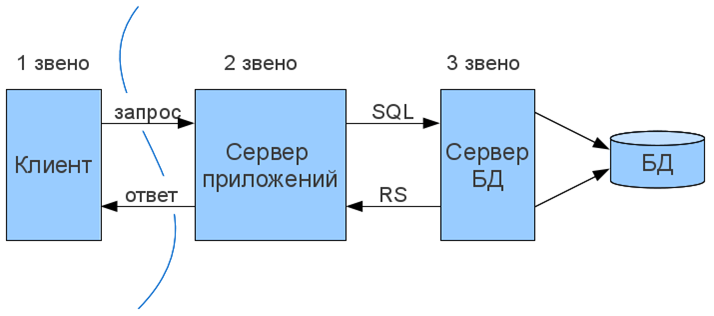

# Основы HTML. Часть 2

## iframe

Данные элементы используются для отображения веб-страницы внутри веб-страницы.

Синтаксис:

```html
<iframe src="URL" width="200" height="200"></iframe>
```

Атрибут `src` определяет URL (адрес) внутренней веб-страницы. Также можно задать ширину и высоту окна со страницей атрибутами `width` и `height`.

Можно также установить iframe как цель для ссылки:

```html
<iframe src="demo_iframe.htm" name="iframe_a"></iframe>
<p><a href="http://www.w3schools.com" target="iframe_a">W3Schools.com</a></p>
```

В данном случае документ по ссылке будет загружен в iframe.

Следующий пример попробуйте воспроизвести в собственном .html файле.

```html
<ul>
  <li><a href="https://www.google.ru" target="myframe">Google</a></li>
  <li><a href="http://www.yandex.ru/" target="myframe">Yandex</a></li>
  <li><a href="https://duckduckgo.com/" target="myframe">DuckDuckGo</a></li>
</ul>

<iframe src="http://example.com/" name="myframe"></iframe>
```

## Form

Формы используются для получения информации, вводимой пользователем.

Элементами форм являются различные типы инпутов:

-   чекбоксы
-   radio-кнопки
-   submit-кнопки
-   и др.

HTML-форму определяет тег `<form>`.

Форма сама по себе не видна на странице, отображаются только ее элементы.

Форма представляет собой множество полей для текстового ввода, кнопки и т.д., содержимое которых отправляется на сервер. Сервер обрабатывает полученную информацию и возвращает ответ пользователю при необходимости.

Форма предназначена для обмена данными между пользователем и сервером. Документ может содержать множество форм, но одновременно на сервер может быть отправлена только одна.



## Атрибуты формы

### Action attrubute

Форме указывается атрибут `action`, определяющий действие при сабмите формы. Сабмит обычно происходит при нажатии кнопки сабмита. Чаще всего форма отправляется веб-серверу. Если атрибут не указан, в действии указывается текущая страница.

[example](http://jsbin.com/voseni/edit?html,output)

### Method attribute

Атрибут метода определяет HTTP-метод (GET или POST), используемый при сабмите формы.

```html
<form action="action_page.php" method="get">
```

или

```html
<form action="action_page.php" method="post">
```

Метод GET используется, когда отправка формы происходит пассивно и в ней не содержится важной информации, т.к. в этом случае информация формы будет видна в адресе страницы: `action_page.php?firstname=Mickey&lastname=Mouse`. Метод подходит для небольших объймов данных. Ограничения на размер установлены в бразуерах.

Метод POST используется при обновлении данных и при наличии важной информации в форме (например, пароли). Метод предоставляет большую безопасность информации.

### Name attribute

Определяет уникальное имя формы. Как правило, имя формы используется для доступа к ее элементам через скрипты.

```html
<form action="action_page.php" name="form1"></form>
```

#Чек-лист верстальщика

Чтобы узнать, готова ли вёрстка к реальному использованию и насколько качественно выполнена работа верстальщика, необходима проверка.
В этом может помочь следующий чек-лист:

Обязательные пункты

1. Соответствие макету
2. Кроссбраузерность, кодировка и DOCTYPE
3. Валидность, доступность
4. Независимость блоков в CSS – минимизация каскада, использование БЭМ
5. Корректное отображение сайта
6. Семантичность кода (корректная структура заголовков (заголовки H1 .. H6, title), и тд)
7. Работоспособность при выключенном JS

Дополнительно – поддержка ретины, отсутствие багов при увеличенном шрифте и др.

## Краткое описание обязательных пунктов

1. Расположение блоков должно быть 1:1 по сравнению с макетом, допускается расхождение до 5px. Приветствуются правки корявых размеров и криво нарисованных блоков (напр., на одной странице блок ниже, на другой выше и это заметно)
2. Кодировка utf8 для универсальности и совместимости. Наличие корректного DOCTYPE необходимо, чтобы страницы отображались в браузерах в соответствии со стандартами. Новый DOCTYPE позволяет использовать новые теги (article, header и др.). Кроссбраузерность – все браузеры последние, IE обычно 7+.
3. Не должно быть JS-ошибок. CSS валидируется по версии 3.0 в W3C, верстальщику так же надо проверять синтаксические ошибки (не px,а xp). Использовать можно статические анализаторы JSHint, CSSLint.
4. Стараться избегать вложенности. Использовать методологию BEM – block, element, modificator. Блок – инкапсулирует стиль, независимая единица. Элемент – составная часть блока, которая не может использоваться вне его. Модификатор- сущность, изменяющая внешний вид блока или элемента. Пример:

```html
<ul class=”toolbar”>
  <li class=”toolbar__item”>
    <a>Edit</a>
  </li>
  <li class=” toolbar__item toolbar__item_active”>
    <a>Edit</a>
  </li>
</ul>
```

```css
.toolbar {
  …
}
.toolbar__item {
…
}

.toolbar__item_active {
…
}
```

5. Сайт должен нормально смотреться во всех стандартных разрешениях от 1024 и выше, не иметь горизонтального скролла и вписываться в экран мобильных устройств. Верстка должна тянуться, не разваливаться, не терять дизайнерский вид при изменении контента на странице. Рекомендуется проверить отсутствие багов при увеличенном шрифте, отступы заголовков, проверить как вводятся/отображаются данные.
6. Семантика это важно. Корректный Document outline (корректно построенный документ, семантически правильный) важен для SEO.
7. Критически важный функционал должен быть доступен без JS. Нельзя забывать, что у многих пользователей все еще медленный интернет, в т.ч. 3G, и многие просто не захотят пользоваться сайтом, который долго загружается

[Источник](https://habr.com/post/114256)
